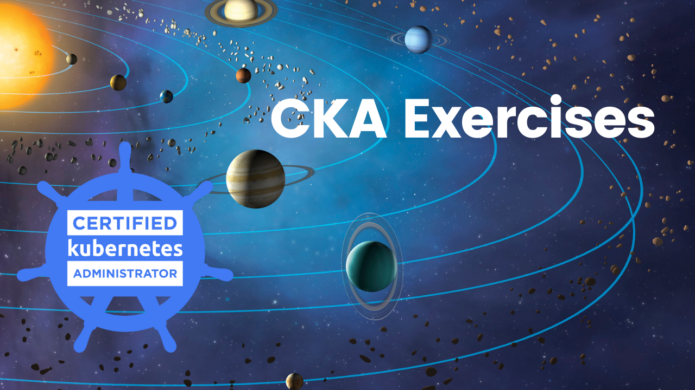
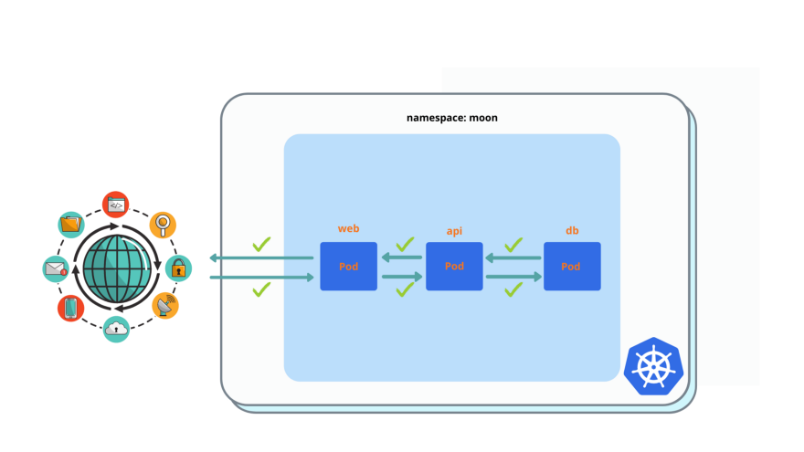
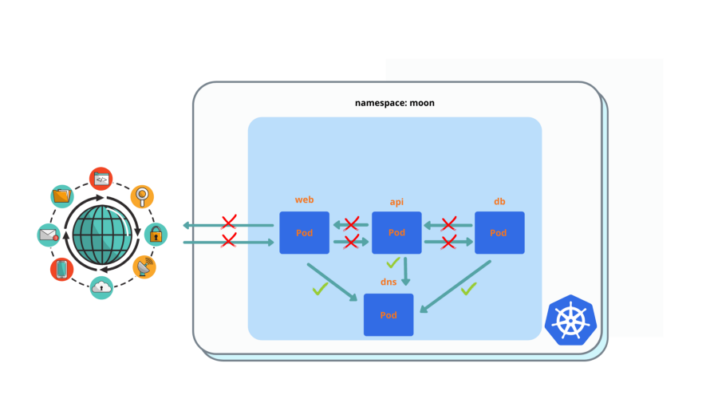
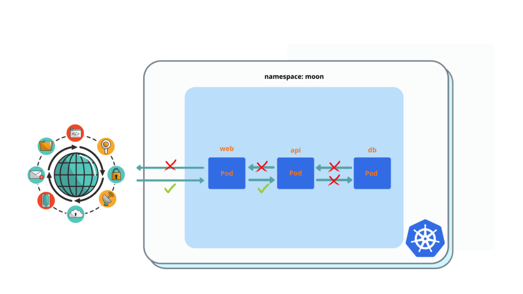
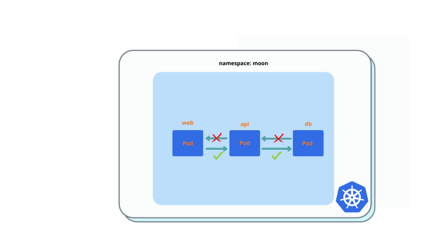
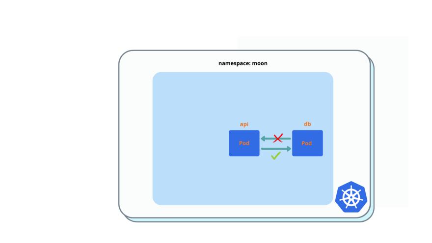
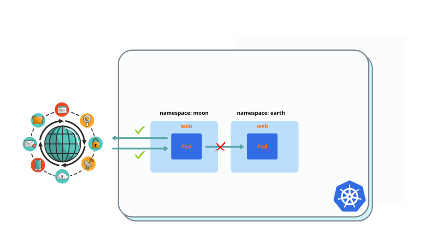

# CKA Exercises



I am a DevOps/Software engineer (at Cloudify.co), and I started preparation for the CKA Kubernetes exam. In this series, I will share some exercises I find useful during my preparation in order to help you better prepare for the CKA exam. I will gather all exercises in this GitHub account, clone this repo to get all exercises at once.

### CKA exercises series published posts:

* Network Policy

## Prerequisites

* Existing Kubernetes cluster

Creation of EKS cluster example:

``` bash
# create cka-pracice EKS cluster with 3 nodes of t3.medium
$ eksctl create cluster \
  --region us-west-2 \
  --node-type t3.medium \
  --nodes 3 \
  --nodes-min 1 \
  --nodes-max 4 \
  --name ka-pracice
```

* Kubernetes cluster with CNI supporting Network Policies, for example, Calico CNI

Install Calico CNI to EKS cluster example: https://docs.aws.amazon.com/eks/latest/userguide/calico.html

``` bash
$ kubectl apply -f https://raw.githubusercontent.com/aws/amazon-vpc-cni-k8s/master/config/master/calico-operator.yaml

$ kubectl apply -f https://raw.githubusercontent.com/aws/amazon-vpc-cni-k8s/master/config/master/calico-crs.yaml
```

## Environment Preparation

1. Create **moon** namespace:

``` bash
$ kubectl create ns moon
```

2. Deploy our **spaceship** application to **moon** namespace:


**spaceship** application consist of 3 pods: web + api  +db, as you can see in this picture.

It's an example of 3 tier application in a single namespace:

* web pod gets external (internet) traffic
* web pod talks to api pod
* api pod talks to db pod
* db talks to no one, only gets traffic from api

Let's deploy it to **moon** namespace

``` bash
$ kubectl run --generator=run-pod/v1 web --image=nginx --labels=app=web --port 80 -n moon
$ kubectl expose pod web --type=ClusterIP --port=80 -n moon

$ kubectl run --generator=run-pod/v1 api --image=nginx --labels=app=api --port 80 -n moon
$ kubectl expose pod api --type=ClusterIP --port=80 -n moon

$ kubectl run --generator=run-pod/v1 db --image=nginx --labels=app=db --port 80 -n moon
$ kubectl expose pod db --type=ClusterIP --port=80 -n moon
```

3. Validate that connections between all pods in **moon** permitted

``` bash
$ kubectl exec -it web -- curl api
$ kubectl exec -it api -- curl db
```

You must see 'Welcome to nginx!' reply in all cases.

4. Create **earth** namespace and deploy the web app there:

``` bash
$ kubectl create ns earth

$ kubectl run --generator=run-pod/v1 web --image=nginx --labels=app=web --port 80 -n earth
$ kubectl expose pod web --type=ClusterIP --port=80 -n earth
```

5. Validate connections between web pod in **earth** to all pods of **moon permitted**:

``` bash
$ kubectl exec -it web -n earth -- curl web.moon
$ kubectl exec -it web -n earth -- curl api.moon
$ kubectl exec -it web -n earth -- curl db.moon
```

You must see 'Welcome to nginx!' reply in all cases.

## Exercises

All actions must be applied to **moon** namespace.

1. Enable pod isolation: drop all connections between pods.


``` bash
# You must see 'Could not resolve host: api' or timeout instead of  'Welcome nignx'

$ kubectl exec -it web -- curl api
$ kubectl exec -it api -- curl db
```

2. Allow all traffic between pods.



Please **delete allow all** network policy after you deployed it and validated it's working.

After you applied this network policy, everything must back to normal.

3. **Improve** pod isolation from 1. , by adding **egress traffic to DNS** for all pods, port 53.



You must see 'Connection timed out' instead of  'Welcome nignx'

``` bash
$ kubectl exec -it web -- curl api
$ kubectl exec -it api -- curl db
```

4. **web pod**: enable ingress for everyone and egress to api pod only.



``` bash
$ kubectl exec -it web -n earth -- curl web.moon
```

You must see 'nginx' welcome page. Egress to api pod still will not work, because you need enable ingress from web on api first.

5. **api pod**: enable ingress from web pod and egress to db pod.



``` bash
$ kubectl exec -it web -- curl api
```

You must see 'nginx' welcome page. Egress to db pod still will not work, because you need enable ingress from api on db first.

6. **db pod**: ingress from api pod only.



``` bash
$ kubectl exec -it api -- curl db
```

You must see 'nginx' welcome page.

7. Add **ingress port filtering for port 80**,  for web / api / db pods.

That how it looks after you applied all network policies from previous 7 exercises (besides 2):


8. **web pod** must have ingress and egress internet access (use external services to work properly), but must **deny egress access to any pod inside of the k8s cluster**, except api pod (which already done previously)  in the same namespace.



After you created and applied policy, you must have no access to web pod in earth namespace from web pod in moon, to have access to google.com, to have ingress access from web in earth

``` bash
$ kubectl exec -it web -n earth -- curl web.moon
$ kubectl exec -it web -- curl google.com
$ kubectl exec -it web -- curl web.earth
```

## Solution

1. Enable pod isolation in **moon** namespace

``` yaml
apiVersion: networking.k8s.io/v1
kind: NetworkPolicy
metadata:
  name: deny-all
spec:
  podSelector: {}
  policyTypes:
  - Ingress
  - Egress
```

2. Allow all traffic between pods in **moon** namespace

``` yaml
kind: NetworkPolicy
apiVersion: networking.k8s.io/v1
metadata:
  name: allow-all
spec:
  podSelector: {}
  policyTypes:
  - Ingress
  - Egress
  
  ingress:
  - {}
  egress:
  - {}
```

3. **Improve** pod isolation from 1. , by adding **egress traffic to DNS** for all pods, port 53.

``` yaml
apiVersion: networking.k8s.io/v1
kind: NetworkPolicy
metadata:
  name: deny-all
spec:
  podSelector: {}
  policyTypes:
  - Ingress
  - Egress
egress:
- ports:
  - protocol: TCP
    port: 53
  - protocol: UDP
    port: 53
```

4. **web pod**: enable ingress for everyone and egress to api pod only

``` yaml
apiVersion: networking.k8s.io/v1
kind: NetworkPolicy
metadata:
  name: web
spec:
  podSelector: 
    matchLabels:
      app: web
  policyTypes:
  - Ingress
  - Egress
  
  ingress:
  - {}
  egress:
  - to:
    - podSelector:
        matchLabels:
          app: api
```

5. **api pod**: enable ingress from web pod and egress to db pod.

``` yaml
apiVersion: networking.k8s.io/v1
kind: NetworkPolicy
metadata:
  name: api
spec:
  podSelector: 
    matchLabels:
      app: api
  policyTypes:
  - Ingress
  - Egress
  
  ingress:
  - from:
    - podSelector:
        matchLabels:
          app: web
  egress:
  - to:
    - podSelector:
        matchLabels:
          app: db
```

6. **db pod**: ingress from api pod only.

``` yaml
apiVersion: networking.k8s.io/v1
kind: NetworkPolicy
metadata:
  name: db 
spec:
  podSelector: 
    matchLabels:
      app: db
  policyTypes:
  - Ingress
  - Egress
  
  ingress:
  - from:
    - podSelector:
        matchLabels:
          app: api
```

7. Add **ingress port filtering for port 80**, for web / api / db pods.


``` yaml
ingress:
- ports:
  - protocol: TCP
    port: 80
```

You must add it to web / api /db network policy.

8. **web pod** must have ingress and egress internet access (use external services to work properly), but must **deny egress access to any pod inside of the k8s cluster**, except api pod (which already done previously) in the same namespace.

``` yaml
egress:
- to:
  - ipBlock:
      cidr: 0.0.0.0/0
      except:
        - 10.0.0.0/8
        - 192.168.0.0/16
        - 172.16.0.0/20
```

It basically means **permit external**(internet) access, but **deny access to local CIDRs**, because your k8s cluster has local IP ranges, egress access to local CIDRs will be denied from web pod.


I will publish new posts of CKA exersises series first in my personal blog: http://igorzhivilo.com, and in this github repo, please clone this repo so I would now it's valuable to you and I will create more of exercises.

Also follow me on medium and Twitter [@warolv](https://twitter.com/warolv)

My account on medium: [warolv.medium.com](warolv.medium.com)

You can find solution yamls in 'network-policies' folder.