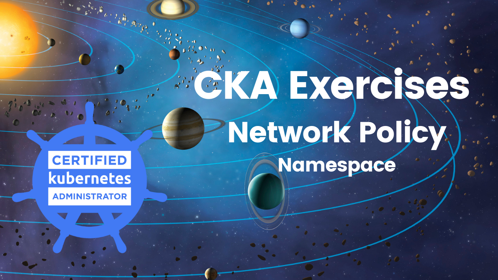
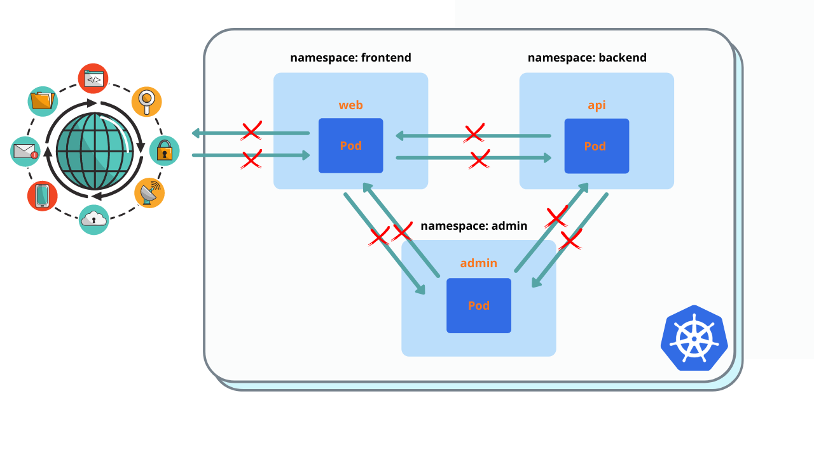
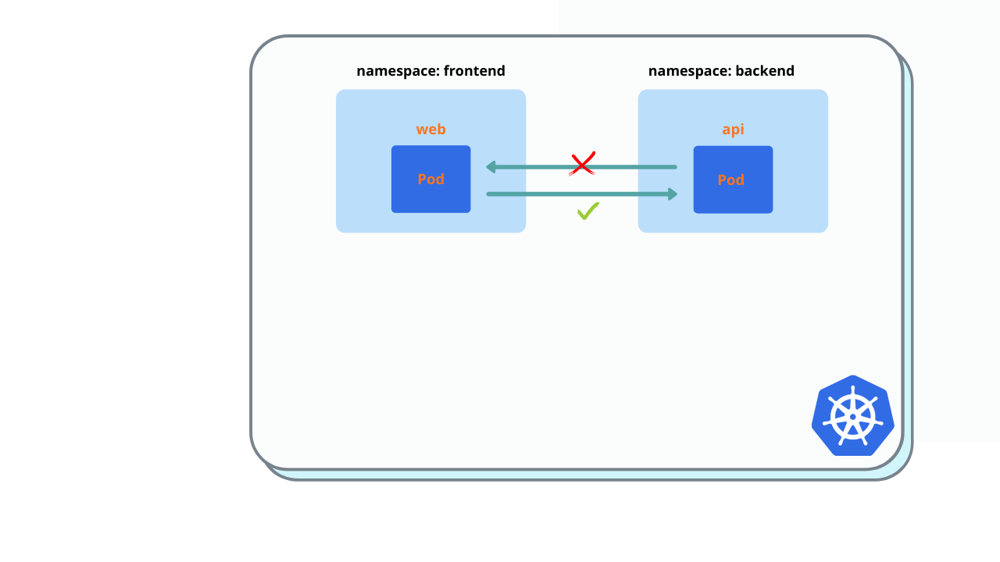
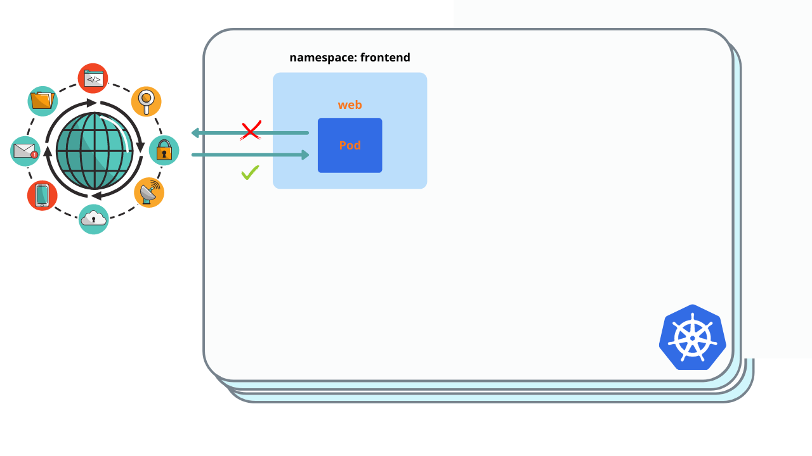
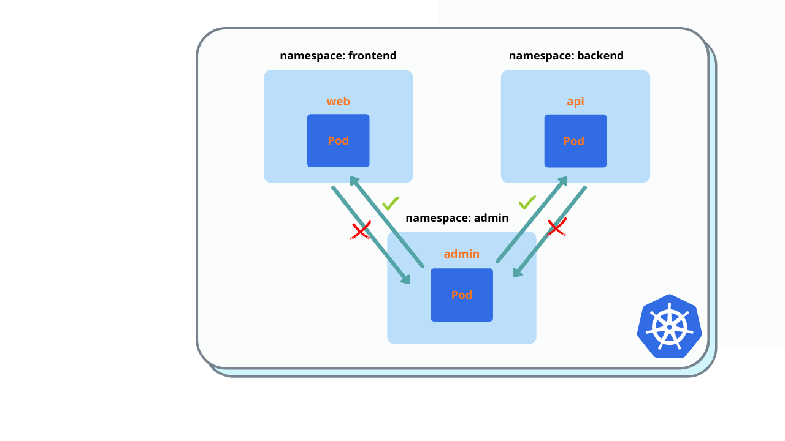

# CKA Exercises



I am a DevOps/Software engineer (at Cloudify.co), and I started preparation for the CKA Kubernetes exam. In this series, I will share some exercises I find useful during my preparation in order to help you better prepare for the CKA exam. I will gather all exercises in this GitHub account, clone this repo to get all exercises at once.

### CKA exercises series published posts:

* [Network Policy](network-policy.md)
* Network Policy, Namespace

## Prerequisites

* Existing Kubernetes cluster

* Kubernetes cluster with CNI supporting Network Policies, for example, Calico CNI

Install Calico CNI to EKS cluster example: https://docs.aws.amazon.com/eks/latest/userguide/calico.html

``` bash
$ kubectl apply -f https://raw.githubusercontent.com/aws/amazon-vpc-cni-k8s/master/config/master/calico-operator.yaml

$ kubectl apply -f https://raw.githubusercontent.com/aws/amazon-vpc-cni-k8s/master/config/master/calico-crs.yaml
```

## Environment Preparation


It's an example of an application with backend/frontend separated with namespaces and admin namespace which need to have access to both namespaces (frontend and backend)

* web pod(frontend) needs to talk with api pod(backend).
* must be an access to web pod from all namespaces.
* admin needs to have access to web/api pods.

1. Create **frontend** namespace and deploy web pod into:

``` bash
$ kubectl create ns frontend
$ kubectl label namespaces frontend role=frontend
$ kubectl run --generator=run-pod/v1 web --image=nginx --labels=app=web --port 80 -n frontend
$ kubectl expose pod web --type=ClusterIP --port=80 -n frontend
```

2. Create backend namespace and deploy api pod into:

``` bash
$ kubectl create ns backend
$ kubectl label namespaces backend role=backend
$ kubectl run --generator=run-pod/v1 api --image=nginx --labels=app=api --port 80 -n backend
$ kubectl expose pod api --type=ClusterIP --port=80 -n backend
```

3. Create admin namespace and deploy admin pod into:

``` bash
$ kubectl create ns admin
$ kubectl label namespaces admin role=admin
$ kubectl run --generator=run-pod/v1 admin --image=nginx --labels=app=admin --port 80 -n admin
$ kubectl expose pod admin --type=ClusterIP --port=80 -n admin
```

4. Create test namespace and deploy test pod into:

``` bash
$ kubectl create ns test
$ kubectl run --generator=run-pod/v1 test --image=nginx --labels=app=test --port 80 -n test
$ kubectl expose pod test --type=ClusterIP --port=80 -n test
```

This namespaces/pod will be used for testing, no network policies will be installed to this namespace

5. Validate that connections between all pods in different namespaces permitted.

``` bash
$ kubectl exec -it web -n frontend -- curl api.backend
$ kubectl exec -it web -n frontend -- curl admin.admin
$ kubectl exec -it admin -n admin -- curl web.frontend
$ kubectl exec -it admin -n admin -- curl api.backend
$ kubectl exec -it api -n backend -- curl web.frontend
$ kubectl exec -it api -n backend -- curl admin.admin
```

You must see 'Welcome to nginx!' reply in all cases.

## Exercises

1. Deny all traffic from all namespaces. Create Network policy and deploy to frontend/backend/admin namespaces.



You must see 'Connection timed out' instead of 'Welcome nignx'

``` bash
$ kubectl exec -it test -n test -- curl api.backend
$ kubectl exec -it test -n test -- curl admin.admin
$ kubectl exec -it test -n test -- curl web.frontend
```

2. Allow ingress in api pod from web pod. Create Network policy and deploy to backend namespace.



You must see 'Welcome nignx'

``` bash
$ kubectl exec -it web -n frontend -- curl api.backend
```

3. Allow ingress to web pod from all namespaces. Create Network policy and deploy to frontend namespace.



You must see 'Welcome nignx'

``` bash
$ kubectl exec -it test -n test -- curl web.frontend
```

4. Allow ingress in api/web pods for admin pod. Modify network policy of api pod and deploy it to backend namespace.



You must see 'Welcome nignx'

``` bash
$ kubectl exec -it admin -n admin -- curl api.backend
$ kubectl exec -it admin -n admin -- curl web.frontend
```

## Solution

1. Deny traffic from all namespaces.

``` yaml
kind: NetworkPolicy
apiVersion: networking.k8s.io/v1
metadata:
  name: deny-access-all-namespaces
spec:
  podSelector:
    matchLabels:
  ingress:
  - from:
    - podSelector: {}
```

2. Allow ingress in api pod from web pod.

``` yaml
kind: NetworkPolicy
apiVersion: networking.k8s.io/v1
metadata:
  name: allow-api-from-frontend
spec:
  podSelector:
    matchLabels:
      app: api
  ingress:
  - from:
    - namespaceSelector:
        matchLabels:
          role: frontend
```

3. Allow ingress in web from all namespaces.

``` yaml
kind: NetworkPolicy
apiVersion: networking.k8s.io/v1
metadata:
  name: allow-web-from-all-namespaces
spec:
  podSelector:
    matchLabels:
      app: web
  ingress:
  - from:
    - namespaceSelector: {}
```

4. Allow ingress in api/web pods for admin pod.

``` yaml
ingress:
  - from:
    - namespaceSelector:
        matchLabels:
          role: admin
```

You need add it to 2 (network policy for api), because web pod already allows ingress from all namespaces.


I will publish new posts of CKA exersises series first in my personal blog: https://igorzhivilo.com, and in this github repo, please clone this repo so I would now it's valuable to you and I will create more of exercises.

Also follow me on medium and Twitter [@warolv](https://twitter.com/warolv)

My account on medium: [warolv.medium.com](https://warolv.medium.com)

You can find solution yamls in 'network-policies-ns' folder.